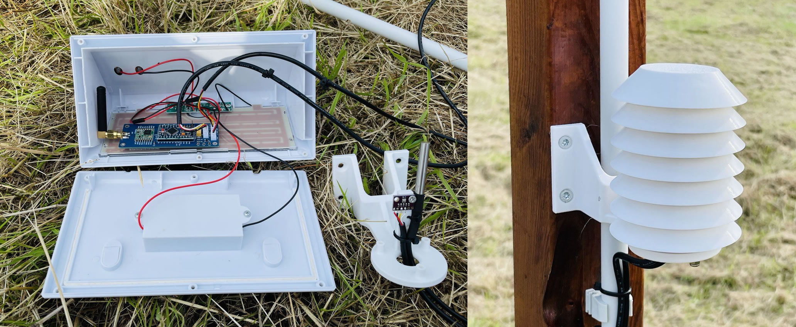

# LoRaProMini - A low power LoRaWAN Node

[
  
  
  
  
  
  
  
  
  
](https://github.com/foorschtbar/LoRaProMini)

A LoRaWAN sensor node for The Things Network, based on an ATMEGA328P (Arduino Pro Mini) and RFM95W/SX1276 LoRa transiver module. 


The module can be used:
- Collect various climate values with environmental sensors. See [Environmental (Weather/Clima) Sensor](#environmental-weatherclima-sensor).
- Tell if the letter carrier has put new letters in your mailbox. See [Mailbox Monitor](#mailbox-monitor).
- Notify if someone rang the doorbell. See [Doorbell Monitor](#doorbell-monitor).
- Act a wirless button
- and many more...

## Features
- Deep sleep MCU and sensors between data transmissions.
- Two interrupt inputs could use to wake up the MCU and sensors from deep sleep.
- Confirmend und unconfirmend data up messages.
- Ultra low power consumption. Under 10μA with all features and sensors.
- Power input 3.5-6V:
    - Battery (Li-Ion with 3.7V works fine)
    - Battery with solar charger
- Sensor support
    - Bosch BME280 (humidity, barometric pressure and ambient temperature)
    - Maxim DS18B20(+)/DS18S20(+)/DS1822 1-Wire temperature sensor 

## Example Applications
### Environmental (Weather/Clima) Sensor
- TBD :warning:
### Mailbox Monitor
- TBD :warning:
### Doorbell Monitor
- TBD :warning:

## More pics

<!---  --->

<!---  --->



## The Things Stack configuration

- LoRaWAN version `MAC V1.0.3`
- TBD :warning:

## How to use

1. Flash config firmware (See [How to flash](#how-to-flash))
1. Start voltage calibration from menu
1. Set a voltage, measure the voltage with a multimeter and note the analog value. The range is optimized up to 6V
1. Use volts-per-bit calculator to get VBP factor for config
1. Create configuration with [Configuration Builder](https://foorschtbar.github.io/LoRaProMini/)
1. Write configuration to EEPROM using configuration menu
1. Check written configuration via configuration menu
1. Flash debug or release firmware (See [How to flash](#how-to-flash))
1. Finish

## How to flash

```
avrdude-F -v -c arduino -p atmega328p -P <COM PORT> -b 57600 -D -U flash:w:<FIRMWARE FILE>:i
```

Example:
```
avrdude -F -v -c arduino -p atmega328p -P COM4 -b 57600 -D -U flash:w:firmware_1.0_config.hex:i
```

## Firmware Changelog

### Version 2.0
- Added wake up trough interrupt pins
- Added option for disable interrupt pins
- Added option for confirmed uplink
- Changed LoRaWAN data up message
    - Added state of interrupt pins
    - Combined major and minor version byte into a single byte (4 bits for major and 4 bits for minor)

### Version 1.1
- Only for testing CI Pipeline

### Version 1.0
- Initial Version

## PCB Changelog

### Version 3.0
- Removed Arduino Pro Mini Dauther PCB
- Added ATMEGA328P direct to the PCB
- Added pins for unused GPIOs
- Added D2 and D3 with Pulldowns and connector as external interrupts (need FW v2.0 or higher)

### Version 2.2
- Added RST pin to connector for programming

### Version 2.1
- Added connector for programming

### Version 2.0
- Smaller PCB
- Rounded Edges
- Fixed issue with DS18x onboard pin mapping

### Version 1.0
- Initial PCB
 
## TTN Payload decoder
```javascript
function decodeUplink(input) {
    var bytes = input.bytes;
    
    var itrTrigger = (bytes[0] & 1) !== 0; // Message was triggerd from interrupt
    var itr0 = (bytes[0] & 2) !== 0; // Interrupt 0
    var itr1 = (bytes[0] & 4) !== 0; // Interrupt 1
    var bat = bytes[1] << 8 | bytes[2]; // Battery
    var fwversion = (bytes[3] >> 4) + "." + (bytes[3] & 0xf); // Firmware version
    var temp1 = (bytes[4] & 0x80 ? 0xFFFF << 16 : 0) | bytes[4] << 8 | bytes[5]; // BME Temperature
    var humi1 = bytes[6] << 8 | bytes[7]; // BME Humidity
    var press1 = bytes[8] << 8 | bytes[9]; // BME Pressure
    var temp2 = (bytes[10] & 0x80 ? 0xFFFF << 16 : 0) | bytes[10] << 8 | bytes[11]; // DS18x Temperature
    
    var mbStatus = "UNKOWN";
    if (itr0) {
      mbStatus = "FULL";
    } else if (itr1) {
      mbStatus = "EMPTY";
    }

    return {
        data: {
            interrupts: {
                itr0: itr0,
                itr1: itr1,
                itrTrigger: itrTrigger
            },
            extra: {
                mbStatus: mbStatus,
                mbChanged: itrTrigger
            },
            fwversion: fwversion,
            bme: {
                temperature: temp1 / 100,
                humidity: humi1 / 100,
                pressure: press1
            },
            ds18x: {
                temperature: temp2 / 100
            },
            battery: bat / 100
        },
        warnings: [],
        errors: []
    }
}
```

## ToDo

- [ ] Go to sleep immediately when voltage is too low
- [x] Add wake up trough interrupt pins
- [x] Move Major- and Minorversion byte to single byte. 4 bits for major and 4 bits for minor.
- [x] Add option for Confirmed Uplink to config
- [x] Add CI/CD pipeline to build firmware
- [x] Rewirte VBP calculator in Configuration Builder
- [x] Move config to EEPROM
- [x] Added special firmware to change configs
- [x] Build HTML/JS Interface to build configs
- [x] Add CRC32 check
- [x] Test ABP
- [x] Test OTAA
- [x] Deploy config tool via GitHub Pages
- [x] Fix problem when checksum in pastend config had zeros O.o
- [x] Add random EUI generator button to config tool
- [x] Parse config string to GUI fields
